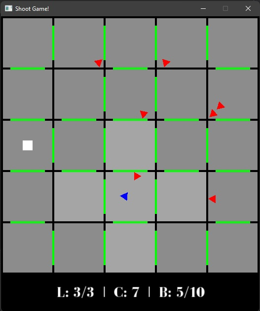

# Anotace
Cílem semestrální práce bylo vytvořit 2D střílecí hru v jazyce C++ s použitím grafické knihovny SFML.

# Přesné zadání
Hra bude ve 2D s pohledem ze shora. Hráč hraje za postavu, která se pohybuje po herní mapě.
Hráč se po mapě pohybuje pomocí klávesnice a myši.

Mapa se skládá ze zdí, které rozdělují herní mapu na 25 stejných místností. Hráč se nemůže pohybovat skrze zdi.
Ve zdech jsou dále umístěny dveře, skrze které hráč může projít do vedlejších místností.

Na herní mapě se na náhodné pozici, jednou za zvolenou dobu, objeví nepřítel (zombie), který se pohybuje směrem k hráči. Pokud se nepřítel dotkne hráče, hráč přichází o jeden ze 3 životů a nepřítel zmizí. Pokud hráč přijde o všechny životy, hra končí. Hráč může nepřítele zlikvidovat pomocí střílení. Hráč vystřelí myší ve směru ukazatele. Pokud hráč zasáhne nepřítele, nepřítel zmizí. Maximální počet nepřátel na mapě je omezený.

Na herní mapě se také na náhodné pozici, jednou za zvolenou dobu, objevují mince, které hráč sbírá. Počet sebraných mincí reprezentuje bodový zisk hráče. Mince se na mapě vyskytuje omezenou dobu, po níž zmizí.

Pokud hráč sebere dostatečné množství mincí, zobrací se na mapě vchod do dalšího patra (levelu).

Cílem hry je sebrat co nejvíce mincí, dostat se do co nejvyššího patra a zlikvidovat co nejvíce nepřátel.

Dalším modifikovaným cílem hry může být sebrání co nevíce mincí bez zlikvidování jediného nepřítele.

# Requirements

Standart C++ 17

Hra používá knihovnu [SFML 2.5](https://www.sfml-dev.org/)

Je zapotřebí nalinkovat následující soubory:
- sfml-graphics.lib
- sfml-window.lib
- sfml-system.lib

Podrobně rozepsaný návod [zde](https://www.sfml-dev.org/tutorials/2.5/start-vc.php)

# Zvolený algoritmus

Hra běží v herní smyčce a herní stav se upravuje každou iteraci pomocí vstupních dat hráče. 
Hra se pomocí grafické knihovny každou iteraci vykreslí do herního okna.

Pohyb se počítá pomocí goniometrických funkcí a sčítáním vektorů pozic.

# Program

## Game
Třída reprezentující samotnou hru. Má 2 základní metody: 
- `update`: upravení herního stavu podle vstupních dat hráče, každou iteraci herní smyčky,
- `render`: vykreslení herního okna každou iteraci herní smyčky. 

Hra si udržuje herní stav (START, RUN a END), instanci třídy `Player`, instancí třídy `Map` a kontejner instancí třídy `Zombie`.

## Player
Třída reprezentující hráče. Základními metodami jsou kromě `update` a `drawAt` metody: 

- `shoot`: vystřelení
- `reload`: přebíjení

Hráč si udržuje kontejner instancí `Bullet` střel, které vystřelí a odkaz na objekt třídy `Room` místnost, ve které se nachází.

## Map
Třida reprezentující herní mapu. Udržuje si kontejner instancí třídy `Room` a kontejner instancí třídy `Door`. Hlavními metodami kromě `update` a `drawAt` jsou:

- `createCoin`: vytvoření mince
- `getRoom`: vrácení určité místnosti

## Zombie
Třída reprezentující nepřítele.

## Bullet
Třída reprezentující střelu.

## Room 
Třída reprezentující místnost. Místnost si udržuje kontejner instancí třídy `Coin` mincí, které jsou v místnosti. Hlavními metodami jsou:

- `getRandomPosition`: vytvoření náhodné pozice v místnosti
- `getNeighborhood`: vrácení okolních místností dané místnosti včetně

## Door
Třída reprezentující dveře mezi místnostmi.

## Person
Předek tříd `Player` a `Zombie`. Definuje a implementuje pohyb hráče a nepřítele po herní mapě.

## Moveable entity
Předek tříd `Person` a `Bullet`. Udržuje si základní informace o směru a síle pohybu.

## Panel
Třída reprezentující informační část herního okna. Udržuje si instance třídy `TextField` textový polích a `Button` tlačítek.

# Pravidla hry

Hra má 3 stavy. START (po spuštění hry), RUN (po kliknutí na tlačítko *Start Game*) a END (po ztrátě všech životů)

Stav: **START**

Po spuštění hry se v herním okně zobrazí název hry a tlačítko s nápisem *Start Game*. Kliknutím na tlačítko začíná hra.


Stav: **RUN**

Herní okno se rozdělí na 2 části. Vrchní, větší část, zobrazuje hru. Spodní zobrazuje informace o životech hráče, počtu sebraných mincí a stav zásobníku hráče.

Hráč (modrý trojúhelník) se zobrazí na mapě a pohybuje se po ní pomocí klávesnice a myši. Klávesou *W* se pohybuje směrem dopředu a pomocí ukazatele myši určuje směr pohybu. Hráč se může pohybovat kdekoliv po mapě, avšak nemůže projít skrze stěny (černé čáry). Z místnosti do místnosti může hráč projít pouze skrz dveře (zelený obdélník ve stěně). Hráč může vystřelit pomocí levého tlačítka myši. Po výstřelu se zobrazí černá kulička, která se pohybuje ve směru hráče v době výstřelu. Pro pohyb kulky platí stejná pravidla jako pro hráče, čili nemůže projít skrze stěny a při střetu se stěnou zmizí. Hráč má omezenou kapacitu zásobníku a pokud vystřílí všechny střely se zásobníků, musí přebít. Kapacita zásobníku je 10 střel a doba přebíjení jsou 2 sekundy. Přebíjení se provádí automaticky po vystřelení všech střel ze zásobníků nebo manuálně pomocí pravého tlačítka myši. Informace o tom, zda hráč přebíjí znázorňuje písmeno R v dolní části herního okna ve stavu zásobníku.

Na mapě se periodicky za určitou dobu objeví nepřítel (červený trojúhelník), který se pohybuje směrem k hráči. Pro pohyb nepřítele platí stejná pravidla jako pro pohyb hráče. Pokud se nepřítel dotkne hráče, hráč ztratí jeden život a nepřítel zmizí. Množství nepřátel, na herní mapě v jeden okamžik, je omezeno. Hráč může nepřítele zlikvidovat pomocí výstřelu, který zasáhne nepřítele. Pohyb nepřátel je o něco pomalejší než pohyb hráče, hráč tudíž může před nepřáteli utíkat.

Na mapě se také periodicky za určitou dobu na náhodné pozici, objevují mince (žluté kruhy), které může hráč sebrat. Mince má omezenou dobu výskytu na mapě (10 sekund) a poté zmizí. Pokud se hráč dotkne mince, minci sebere. Počet sebraných mincí znázorňuje dosažené skóre hráče.

Pokud hráč sebere dostatečné množství mincí, objeví se na mapě vchod do dalšího patra (bílí čtverec). Pokud hráč vstoupí do vchodu, přesune se do vyššího patra. Nepřátelé zústavají v nižším patře, zásobník hráče se během přesunu dobije ale životy zůstavají stejné.

Hráč vidí pouze mince v jeho okolí (světlejší barva podlahy). Konkrétněji vídí všechny mince v místnosti, ve které se nachází a v místnostech přímo sousedících (mezi místnostmi jsou dveře).

Hra končí, pokud hráč přijde o všechny životy (3).



Stav: **END**

Zobrazí se nápis *Game Over* a pod ním informace o dosaženém levelu, počtu sebraných mincí a zlikvidovaných nepřátel. Pod informacemi se zobrazí také tlačítko s nápisem *New Game*, které po kliknutí zahájí novou hru.


# Nastavení Hry

nastavení jednotlivých levelů jsou v souboru `LevelSettings.txt`. 

Nastavení levelu se skládá z:

- spawn cooldown nepřítele
- maximální počet nepřátel
- spawn cooldown mincí
- počet mincí potřebných pro zobrazení vchodu do dalšího patra (levelu)
- nastavení mapy (rozložení dveří v mapě patra)

## Příklad

```txt
2500
20
2000
10
xxxxxxxxxxx
x.d.d.d.d.x
xdxwxdxwxdx
x.w.d.d.w.x
xdxdxdxdxdx
x.d.d.d.d.x
xdxdxdxdxdx
x.w.d.d.w.x
xdxwxdxwxdx
x.d.d.d.d.x
xxxxxxxxxxx
###
```

Nastavení každého levelu končí sekvencí znaků `###`, hned za ním může pokračovat nastavené dalšího levelu.

Nepřítel se objeví každých 2500 milisekund. Maximální počet nepřátel je 20. Mince se objeví každých 2000 milisekund. Je potřeba 10 sebraných mincí pro zobrazení vchodu do dalšího levelu.

### Nastavení mapy

Počet znaků a jejich umístění je pro všechny nastavení mapy stejné. Jediné co se mění jsou symboly `d` a `w`, neboli ve stěně jsou dveře, respektive ve stěně nejsou dveře.

- `x` : stěna/roh (neměný)
- `.` : místnost (neměný)
- `d` : ve stěne jsou dveře
- `w` : ve stěně nejsou dveře

# Průběh práce

Jako první jsem se začal učit s grafickou knihovnou SFML a poté jsem začal pracovat na pohybu herních entit. 

Vytvořil jsem si herní okno, objekt, se kterým mohu pohybovat a stěnu, která mi v pohybu brání. Poté jsem přidal více stěn a vytvořil herní mapu. 

Do herní mapy jsem začal přidávat dveře, kterými lze projít a itemy, které lze sebrat. Tím se hra stávala čím dál tím hratelnější a zábavnější.

Úplné hratelnosti hra dosáhla s přidáním nepřátel a střílení. dlouho jsem přemýšlel nad pohybem nepřátel a globální sledování a pohyb za hráčem, se mi zdál nejsnazší, ale zároveň i nejúčinnější co se týče herního zážitku.

Nakonec jsem přidal úvodní panel s tlačítkem pro zahájení hry, informační panel pro sledování herního stavu a závěrečný panel s tlačítkem pro spuštění nové hry.

# Co nebylo doděláno

Hráč má možnost na mapě sbírat pouze mince, avšak prvotním plánem bylo, že by mohl sbírat i náhradní životy, případně nové náboje.

Další funkcionalita, která nebyla dodělána je chytřejší pohyb nepřátel (přirozenější pohyb).

# Závěrečný povzdech

Jazyk C++ se teprve učím a primárně používám jazyky jiné. Na C++ jsem si ale rychle zvykl a snažil jsem se v průběhu práce využít jeho potenciál v rozsahu, který jsem se naučil. Vytváření hry mě moc bavilo a musím se přiznat, že jsem si chtěl podobnou hru zahrát už dlouho.
